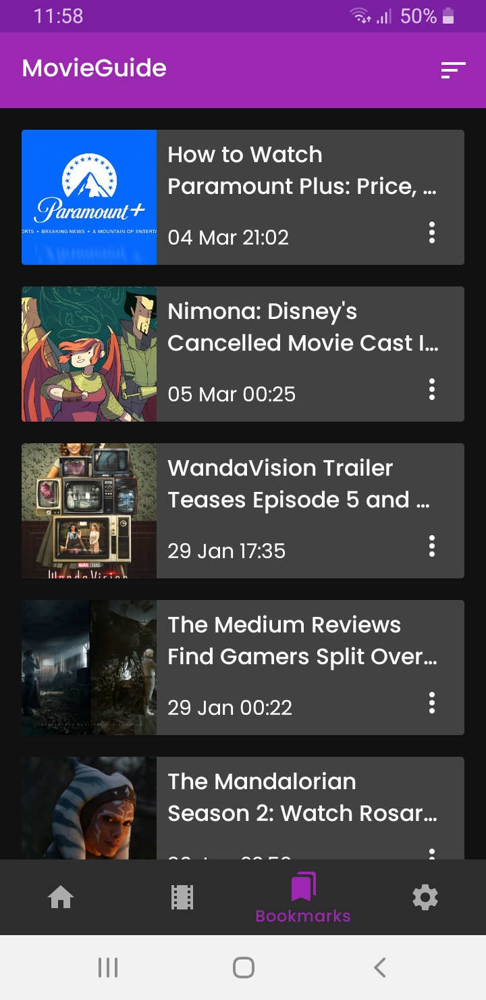
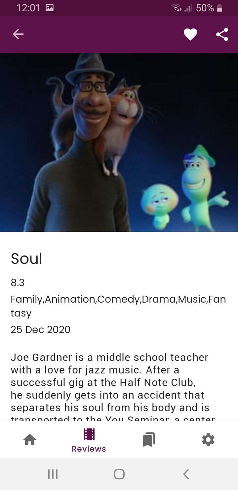
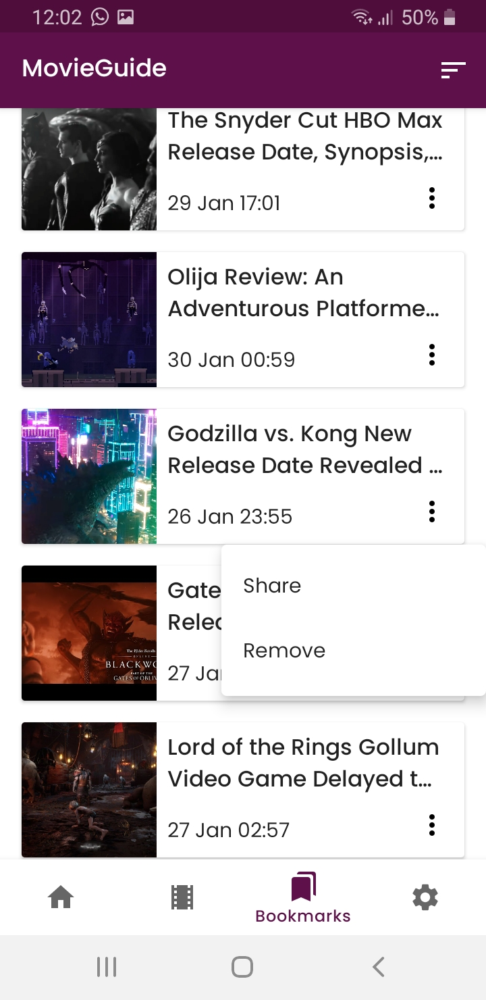

# MovieGuide
> Movies news and content android app

## Table of contents
* [General info](#general-info)
* [Screenshots](#screenshots)
* [Technologies](#technologies)
* [Setup](#setup)
* [Features](#features)
* [Status](#status)
* [Management](#management)
* [Architecture](#architecture)
* [QA](#qa)

## General info
Provides the latest news and detail about movies, allowing the user to stay informed  on current events from the movie industry

## Screenshots
        

## Technologies
* Project planing and management - Github Projects, Leanboards
* Implementation\code base - android studio ide, android sdk, kotlin

## Setup
App requires min sdk 21 to run(android 5.0 lollipop). Currently the app is not available in play store, so in order to run it, download the project from repo, and open it in android studio. Build and run the ‘app’ module on a device of your choice.

## Features

* News articles
* Movie deatail & reviews
* Content bookmarking & sharing
* News update notification

## Status
Ongoing development, look in the 'Projects' section of repository for more detailed  staus info.

## Management 
Planing and management for this project is done using the principles of scrum, utilizing github projects feature. In order to facilitate user story refinement and feature delivery, BDD methods are applied to map stories to functional requirements.Code delivery itself is done via CI\CD pipeline which use gits ‘branch by feature’ approach,that triggers test runs for each push to this repository, upon successful push branches are deleted.

## Architecture
Software solution utilizes domain driven design principles along with clean architecture specification, as the structural guidelines for implementation.

## QA
App qa is based on the usage of TDD\BDD to apply the proposed code coverage by the testing pyramid model,that results in tests layer that include unit,integration,and e2e tests. In addition CI hookup system(circleci) run all tests per each code push to repository. End to end tests are based on google firebase test lab
